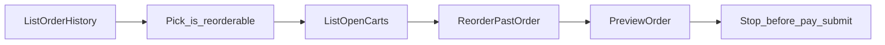

# Plan: Phase 1 — Reorder flow (easiest usable path)

**Approach:** build the **shortest usable end-to-end path** first, not a grab-bag of easy reads.

Early wrappers taught the shared CLI pattern (`RunCLICommand` + `structuredContent`). Phase 1 is a **vertical slice**: reorder a past order up through quote preview — then stop before payment / submit.

`ListDeliveryAddresses` stays as a **quick-win** read (useful, tiny API). It can ship in this branch or split to its own PR later.

Source of truth: sibling notes `dd-cli-agent-reference.md` (v0.2.1). Always `--json-output`. Assume `dd-cli login` already done.

Branch: `feat/tier-1-reorder`.

---

## Why reorder

DoorDash’s documented flows (restaurant / grocery / reorder) all end at preview → ask → submit. **Reorder** needs the fewest new wrappers and reuses `ListOrderHistory`:

```
order history → pick reorderable order_uuid
     → cart list --store-id (collision check)
     → order reorder --order-uuid   (creates cart; mutation)
     → order preview --cart-uuid    (quote; no charge)
     → STOP (no payment-method list, no order submit)
```

Restaurant/grocery need search/menu/find-items + `cart add-items` JSON before the same preview gate — better as later phases.

---

## Target flow



Caller responsibilities (in `cmd/server` or later HTTP):

1. Call `ListOrderHistory` (wide enough `--days` / `--max`).
2. Choose an order with `IsReorderable == true`.
3. `ListOpenCarts` for that `StoreID` — surface collision if an open cart already exists.
4. If no collision: `ReorderPastOrder` → new `cart_uuid`; diff items vs history for silent drops.
5. `PreviewOrder` → print quote summary; **do not submit**.

---

## In scope (phase 1)

| Go API | CLI | Role |
|--------|-----|------|
| `ListOrderHistory` | `order history` | Pick `order_uuid` |
| `ListOpenCarts` | `cart list` | Collision check (`--store-id` optional) |
| `ReorderPastOrder` | `order reorder` | Create cart from past order |
| `PreviewOrder` | `order preview` | Quote only (minimal options first) |
| `ListDeliveryAddresses` | `address list` | Quick-win read (keep; optional separate PR) |

### Scaffolding / later phases

| Go API | CLI | Notes |
|--------|-----|------|
| `CLIClient` / `BuildIntent` / `RunCLICommand` / `decodeStructuredContent` | — | Shared plumbing |
| `FindNearbyStores` | `find-nearby-stores` | Grocery phase later |

---

## Explicitly out of scope (this phase)

- `payment-method list`, `order submit`, `order checkout-url`, tips charged via submit
- Restaurant / grocery discovery + `cart add-items`
- Cart delete / replace on collision (surface only; caller decides later)
- `address set`, promo apply/remove, login helper
- Replacing `dd-cli` with direct DoorDash HTTP
- Rewriting git history (keep commits; address list may split to its own PR)

---

## Package layout

```
wip/
├── plan/phase-1.md             ← this file
├── cmd/server/main.go          ← runReorderFlow() + optional address probe
└── internal/ddcli/
    ├── client.go
    ├── address.go              ← ListDeliveryAddresses
    ├── stores.go               ← FindNearbyStores (later grocery)
    ├── order.go                ← ListOrderHistory, ReorderPastOrder, PreviewOrder
    └── cart.go                 ← ListOpenCarts
```

---

## Implementation order

1. **`ListOpenCarts`** — read-only; optional `storeID` (omit when empty).
2. **`ReorderPastOrder(ctx, intentText, orderUUID)`** — mutation; return new cart uuid.
3. **`PreviewOrder(ctx, intentText, cartUUID)`** — read quote; cart uuid + intent only at first.
4. **`runReorderFlow` in `cmd/server`** — history → first reorderable → cart check → reorder (or reuse open cart) → preview → stop.
5. Keep `runListDeliveryAddresses` as an optional quick-win probe.

---

## Conventions

- Descriptive Go names; JSON wire tags match CLI.
- `context.Context` on every call; omit empty optional flags.
- Decode `structuredContent`; treat `success: false` / `isError` as errors.
- Docs comments follow [docs/function-docs.md](../docs/function-docs.md).

---

## Done when

- [x] Shared plumbing + `ListDeliveryAddresses` / `ListOrderHistory` / `FindNearbyStores`
- [x] `ListOpenCarts`
- [x] `ReorderPastOrder`
- [x] `PreviewOrder`
- [x] `runReorderFlow` demo that stops after preview (no payment / submit)
- [x] No payment APIs in the package
- [x] Plan lives at `plan/phase-1.md` (reorder-first)

---

## Next phases (not this one)

1. **Restaurant:** `search` → `menu` → `cart add-items` → reuse `PreviewOrder`
2. **Grocery:** `FindNearbyStores` → `find-items` → `cart add-items` → preview
3. **Checkout:** payment strategy + `order submit` + `order status` (explicit user confirmation only)
